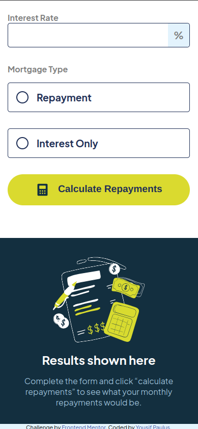

# Frontend Mentor - Mortgage repayment calculator solution

This is a solution to the [Mortgage repayment calculator challenge on Frontend Mentor](https://www.frontendmentor.io/challenges/mortgage-repayment-calculator-Galx1LXK73). Frontend Mentor challenges help you improve your coding skills by building realistic projects.

## Table of contents

- [Overview](#overview)
  - [The challenge](#the-challenge)
  - [Screenshot](#screenshot)
  - [Links](#links)
- [My process](#my-process)
  - [Built with](#built-with)
  - [What I learned](#what-i-learned)
  - [Continued development](#continued-development)
  - [Useful resources](#useful-resources)
- [Author](#author)
- [Acknowledgments](#acknowledgments)

## Overview

### The challenge

Users should be able to:

- Input mortgage information and see monthly repayment and total repayment amounts after submitting the form.
- See form validation messages if any field is incomplete.
- Complete the form only using their keyboard.
- View the optimal layout for the interface depending on their device's screen size.
- See hover and focus states for all interactive elements on the page.

### Screenshot





### Links

- Solution URL: [GitHub Repository](https://github.com/yousifpa98/fm_mortage-calculator)
- Live Site URL: [Live GitHub Pages Site](https://yousifpa98.github.io/fm_mortage-calculator)

## My process

### Built with

- Semantic HTML5 markup
- CSS custom properties
- Flexbox
- CSS Grid
- Mobile-first workflow
- JavaScript

### What I learned

I learned how to effectively calculate mortgage payments using JavaScript, and I gained a better understanding of form validation and how to handle different mortgage types (repayment vs interest-only). Here's a small example of the mortgage calculation logic:

```js
const monthlyPayment = (amount * rate) / (1 - Math.pow(1 + rate, -term));
const totalPayment = monthlyPayment * term;
```

### Continued development

In the future, I want to explore adding more complex mortgage types and possibly integrating external APIs to enhance the calculator's functionality. Additionally, I plan to further refine my JavaScript skills and experiment with using React to build similar projects.

### Useful resources

- [MDN Web Docs](https://developer.mozilla.org/) - Helped with understanding form validation and input types.
- [Frontend Mentor Community](https://www.frontendmentor.io/community) - Great place for feedback and inspiration.

## Author

- GitHub - [yousifpa98](https://github.com/yousifpa98)
- Frontend Mentor - [@yousifpa98](https://www.frontendmentor.io/profile/yousifpa98)

## Acknowledgments

Shoutout to the Frontend Mentor community for providing valuable feedback on this project!